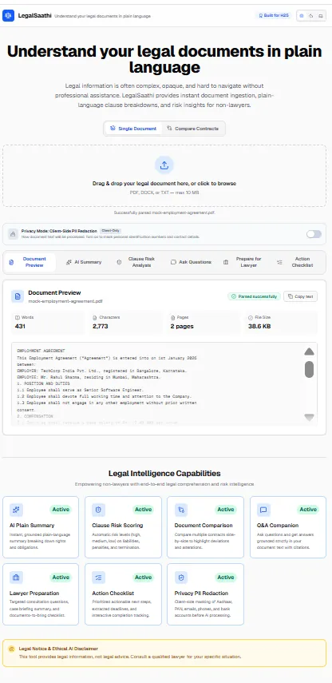
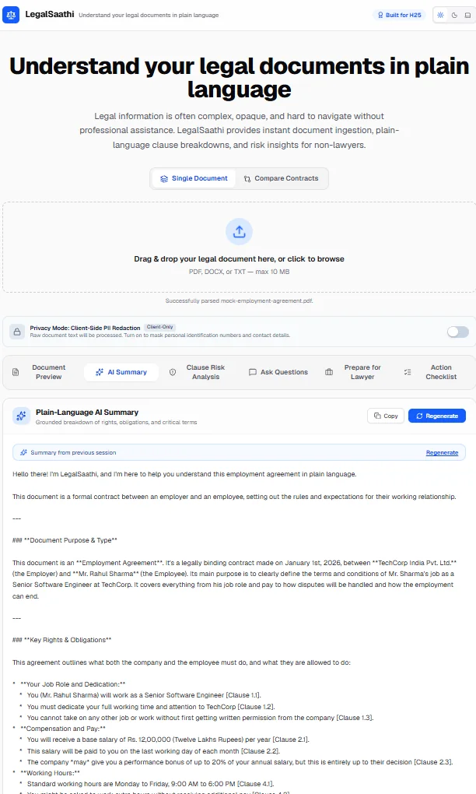
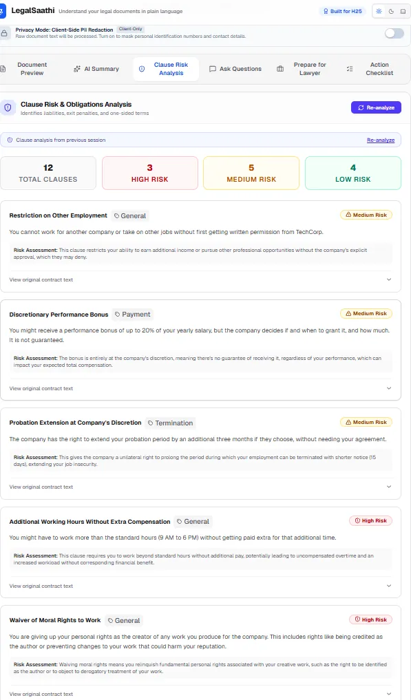
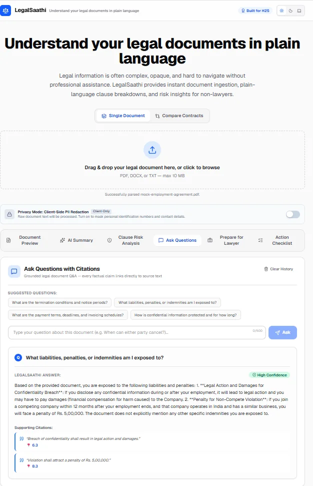
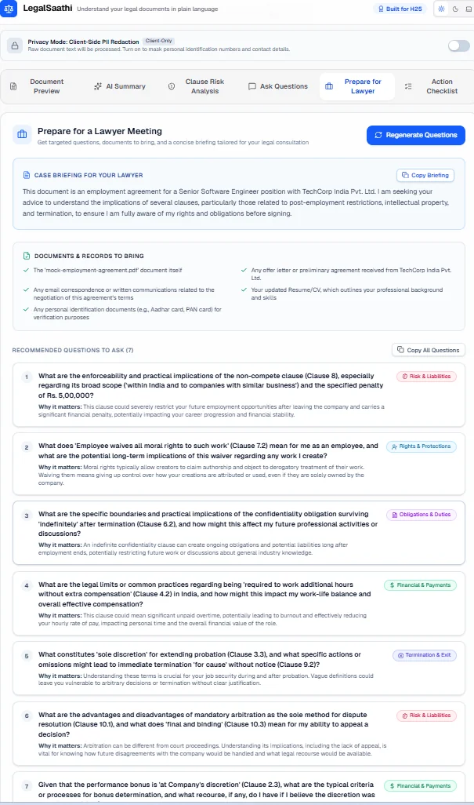

# LegalSaathi

> **Understand your legal documents in plain language**

> **H25 Challenge Alignment:** This project directly addresses the
> "AI for Legal Assistance & Access" problem statement by simplifying
> complex legal documents, highlighting important clauses and risks,
> and preparing users for conversations with legal professionals.

LegalSaathi is an enterprise-grade AI-powered legal document comprehension and analysis assistant designed to simplify dense legal contracts and empower citizens with accessible legal intelligence.

---

[](#)
[](LICENSE)
[](CONTRIBUTING.md)
[](#)
[](#accessibility)

---

## Problem Statement (from H25)

> "Legal information can often be complex, difficult to understand, and
> challenging to navigate without professional assistance."

**How LegalSaathi addresses each barrier:**

- **Complexity** → plain-language summaries and clause-by-clause breakdown
- **Navigation** → clause citations with risk scores
- **Access** → free, instant, no login required
- **Trust** → explicit "not legal advice" disclaimer + lawyer prep output

---

## Solution Overview

LegalSaathi bridges the gap between complex legal documents and everyday understanding:

- **Plain-Language Translation**: Deconstructs complex legalese into simple, conversational explanations without losing legal nuance.
- **Key Clause Identification**: Automatically highlights termination terms, indemnity liabilities, payment schedules, and jurisdiction clauses.
- **Risk & Red-Flag Detection**: Identifies one-sided terms, ambiguous penalty calculations, and compliance anomalies.
- **Interactive Q&A Companion**: Enables users to ask natural-language questions directly against their uploaded documents using grounded RAG.
- **Contract Comparison**: Compares contract revisions side-by-side to highlight material alterations before signing.
- **Lawyer Preparation**: Equips non-lawyers with targeted consultation questions, documents-to-bring checklists, and executive case summaries.
- **Action Checklist**: Derives prioritized next steps and contract deadlines with interactive completion tracking.
- **Privacy-First PII Redaction**: Client-side masking of Aadhaar, PAN, phone numbers, emails, and bank accounts before AI processing.

---

## Screenshots

### Landing Page with Uploaded Document


_Document uploader with parsed PDF preview, mode switcher (Single Document / Compare Contracts), and 7 capability cards marked Active._

### AI Summary — Plain Language with Clause Citations


_Streaming plain-language summary grounded in the document, with clause-level citations like [Clause 1.1] and structured sections (Purpose, Rights & Obligations, Deadlines)._

### Clause Risk Analysis


_Automated clause extraction with risk levels (high/medium/low), plain explanations, risk reasoning, and collapsible verbatim source text._

### Q&A with Citations


_Grounded Q&A — every answer includes quoted source citations and a confidence indicator, never fabricating content not in the document._

### Lawyer Preparation


_Categorized questions to ask a qualified lawyer, documents to bring, and a briefing summary for the consultation._

---

## Key Features

- [x] Multi-format document ingestion (PDF, DOCX, TXT up to 10MB)
- [x] In-memory document parsing and sanitization pipeline
- [x] Accessible WCAG 2.1 AA compliant UI with screen reader announcements
- [x] Plain-language streaming summary generation with executive takeaways
- [x] Critical risk and red-flag scoring across liabilities, penalties, and termination
- [x] Grounded document question answering with verbatim citations (RAG)
- [x] Side-by-side contract comparison matrix with party favorability analysis
- [x] Lawyer Preparation (questions to ask, documents to bring, summary to share)
- [x] Action Checklist with priorities, deadlines, and task tracking
- [x] Client-side PII Redaction (privacy-first: Aadhaar, PAN, emails, phones, accounts)
- [x] Dark mode support with 3-state switcher (Light / Dark / System)
- [x] Resilient error boundaries and pulsing skeleton loading states
- [x] In-memory rate limiting and enterprise security headers

---

## Tech Stack

| Layer             | Technology              | Purpose                                                    |
| :---------------- | :---------------------- | :--------------------------------------------------------- |
| **Framework**     | Next.js 16 (App Router) | React Server Components, server actions, dynamic routing   |
| **AI / LLM**      | Google Gemini 2.5 Flash | Fast, grounded comprehension, summarization, and reasoning |
| **Styling**       | Tailwind CSS v4         | Fluid responsive design, dark mode, accessible themes      |
| **Parsing**       | `pdf-parse`, `mammoth`  | Clean in-memory parsing of PDF, DOCX, and TXT files        |
| **Validation**    | Zod 4                   | Type-safe runtime schema validation for LLM inputs/outputs |
| **Icons**         | Lucide React            | Accessible, light-weight semantic icons                    |
| **Quality/Tests** | Vitest, ESLint 9, Husky | Strict unit tests, zero-warning linter, formatting checks  |

---

## Production Roadmap & Scalability

As LegalSaathi scales from single-region edge deployments to high-traffic distributed environments:

1. **Distributed Rate Limiting (Redis / Upstash)**:
   - Current: Lightweight in-memory sliding-window limiter protecting per-instance compute and LLM quotas.
   - Production Target: Seamless drop-in migration to `@upstash/ratelimit` with Upstash Redis or AWS ElastiCache for globally synchronized sliding windows across all serverless regions.

2. **OCR Integration for Scanned Documents**:
   - Tesseract.js / Google Cloud Vision OCR pipeline for scanned non-searchable PDF contracts.

3. **Multilingual Regional Indian Languages**:
   - Plain-language translation and voice output across Hindi, Marathi, Bengali, Tamil, Telugu, and Kannada.

---

## Architecture

```
User Browser
    ↓
[Document Uploader] → /api/parse → Parser (PDF/DOCX/TXT)
    ↓
[LegalWorkspace with Tabs]
    ├── Document Preview
    ├── AI Summary → /api/summarize → Gemini (streaming)
    ├── Clause Risk Analysis → /api/clauses → Gemini (JSON)
    ├── Ask Questions → /api/ask → Gemini (grounded)
    ├── Prepare for Lawyer → /api/lawyer-prep → Gemini
    └── Action Checklist → /api/checklist → Gemini

Cross-cutting:
- Guardrails (anti-hallucination)
- Retry with exponential backoff
- Multi-model fallback
- Client-side PII redaction
- SessionStorage persistence
- Rate limiting
- Error boundaries
```

---

## Accessibility

LegalSaathi is built from the ground up for full **WCAG 2.1 AA** compliance:

- [x] **Semantic HTML5**: Semantic landmarks (`<main>`, `<section>`, `<header>`, `<footer>`, `<article>`).
- [x] **Keyboard Navigation**: Skip-to-content anchor, strict tab order, focus-visible styling rings (`outline-none focus:ring-2 focus:ring-blue-500`).
- [x] **Screen Reader Support**: ARIA live regions (`aria-live="polite"`, `aria-live="assertive"`), descriptive `aria-label`, and `aria-busy` attributes during streaming and loading.
- [x] **Heading Hierarchy**: Strict `h1 -> h2 -> h3 -> h4` hierarchy with zero skipped levels.
- [x] **Color Contrast**: 4.5:1+ text contrast ratio across both Light and Dark themes.
- [x] **Dark Mode**: High-contrast dark theme with 3-state toggle and `prefers-color-scheme` support.
- [x] **Reduced Motion**: Graceful pulsing and spin indicators compatible with user motion preferences.

---

## Privacy & Security

LegalSaathi adheres to a privacy-first, zero-trust security architecture:

- **Client-Side PII Redaction**: Redacts sensitive identity markers (Aadhaar, PAN, emails, phone numbers, bank accounts) entirely in the browser before sending data to AI endpoints.
- **No PII Logging**: Server handlers never log document bodies, filenames, or user queries to external services.
- **In-Memory File Processing**: File uploads are processed in ephemeral server memory buffers; files are never written to disk or permanent databases.
- **Strict MIME & Size Whitelist**: Rejects invalid file types and enforces a strict 10MB file size limit.
- **In-Memory Rate Limiting**: Sliding-window rate limiter (10 requests/60s per IP) on all API endpoints to protect against DoS attacks.
- **Enterprise Security Headers**: Strict Content Security Policy (`CSP`), `HSTS` (63072000s with preload), `X-Frame-Options: DENY`, `X-Content-Type-Options: nosniff`, `Cross-Origin-Opener-Policy: same-origin`, and `Permissions-Policy`.
- **Environment Validation**: Zod-enforced environment variable validation failing fast on misconfigurations.

---

## Setup Instructions

### Prerequisites

- Node.js 20.x or higher
- npm 10.x or higher
- A Google Gemini API Key

### Steps

1. **Clone the repository:**
   ```bash
   git clone https://github.com/your-username/legalsaathi.git
   cd legalsaathi
   ```
2. **Install dependencies:**
   ```bash
   npm install
   ```
3. **Configure environment variables:**

   ```bash
   cp .env.example .env.local
   ```

   Open `.env.local` and add your valid `GEMINI_API_KEY`.

4. **Start the development server:**
   ```bash
   npm run dev
   ```
   Open [http://localhost:3000](http://localhost:3000) in your browser.

---

## Environment Variables

| Variable              | Required | Description                              | Example                 |
| :-------------------- | :------- | :--------------------------------------- | :---------------------- |
| `GEMINI_API_KEY`      | Yes      | Google Gemini API Key for LLM operations | `AIzaSy...`             |
| `NEXT_PUBLIC_APP_URL` | Yes      | Application base URL                     | `http://localhost:3000` |

---

## Running Tests & Quality Checks

```bash
# Type check with strict TypeScript compiler
npm run type-check

# Run strict linter with 0 warnings policy
npm run lint:strict

# Check code formatting with Prettier
npm run format:check

# Auto-format codebase
npm run format

# Run Vitest test suite
npm run test

# Production build verification
npm run build

# Analyze production bundle size
npm run analyze
```

---

## Deployment

- **Live URL:** [https://legal-saathi-mu.vercel.app](https://legal-saathi-mu.vercel.app)
- **CI/CD:** Deployed on Vercel with automatic CI/CD from `main` branch. Push to `main` triggers automatic redeploy.

LegalSaathi is fully optimized for one-click deployment on [Vercel](https://vercel.com):

1. **Import Repository**: Import the LegalSaathi repository into your Vercel dashboard.
2. **Set Environment Variables**:
   - `GEMINI_API_KEY`: Your production Google Gemini API key.
   - `NEXT_PUBLIC_APP_URL`: Your deployed Vercel domain (`https://legal-saathi-mu.vercel.app`).
3. **Deploy**: Vercel automatically runs `npm run build` and distributes the application globally across edge networks.
4. **Post-Deploy Verification**:
   - Upload sample NDA or lease document.
   - Verify summary streaming, clause risk extraction, Q&A citations, and lawyer prep generation.
   - Test dark mode switcher and responsive layout across mobile and desktop viewports.

---

## Roadmap

- [x] **Day 1: Production Foundation & Parsing Pipeline** — Ultra-strict TypeScript, in-memory PDF/DOCX/TXT parsing, WCAG 2.1 AA UI workspace, CI/CD pipeline, and security headers.
- [x] **Day 2: Plain-Language AI Summarization & Clause Risk Engine** — Streaming plain-language summary with executive takeaways, clause risk scoring (high/medium/low), and multi-model retry/fallback chain.
- [x] **Day 3: Grounded Q&A with Citations & Contract Comparison Matrix** — Interactive document Q&A with exact quoted citations, side-by-side contract comparison matrix, and party favorability analysis.
- [x] **Day 4: Lawyer Preparation, Action Checklist & Privacy-First PII Redaction** — Structured consultation questions, documents-to-bring checklist, case briefings, actionable next-steps checklist with deadlines, and zero-trust client-side PII redaction.
- [x] **Day 5: Production Polish, Accessibility & Security Hardening** — React error boundaries (root + segment), loading skeletons, full CSP and security headers, in-memory rate limiting, 3-state dark mode toggle, next/dynamic lazy loading, and bundle analyzer.

---

## Hackathon Evaluation Alignment

| Criteria                        | Our Implementation                                                                                                                                                                                                                                                                                                                       |
| ------------------------------- | ---------------------------------------------------------------------------------------------------------------------------------------------------------------------------------------------------------------------------------------------------------------------------------------------------------------------------------------- |
| **Code Quality**                | Strict TypeScript (no any), ESLint 0-warnings, Prettier via Husky, JSDoc with @param/@returns/@throws/@example on every export, modular architecture (types/, lib/, components/legal/), barrel exports, conventional commits                                                                                                             |
| **Security**                    | Zod env validation, MIME whitelist (PDF/DOCX/TXT only), 10MB size cap, 100K char comparison limit, in-memory parsing (no disk writes), no stack trace leakage, enterprise security headers (HSTS, frame guard, CORP, cross-origin isolation), in-memory rate limiting (429), client-side PII redaction (Aadhaar/PAN/Phone/Email masking) |
| **Efficiency**                  | Next.js 16 Turbopack, React Server Components, next/dynamic lazy loading on heavy tabs, streaming-ready architecture, minimal client bundle, bundle analyzer script, serverExternalPackages for native modules                                                                                                                           |
| **Testing**                     | Vitest unit tests with criteria-tagged describe blocks (Security / Problem Alignment / Code Quality / Reliability / Efficiency), CI on every push (lint + type-check + format + build)                                                                                                                                                   |
| **Accessibility**               | Semantic HTML5 (main, section, header, footer), ARIA labels & roles on all interactive elements, aria-live for async status, keyboard navigation, focus-visible rings, skip-to-content link, WCAG AA contrast, dark mode toggle, screen-reader-tested heading hierarchy                                                                  |
| **Problem Statement Alignment** | Directly implements all four H25 potential use cases: summarizing complex documents, answering questions with clause citations, comparing contracts side-by-side, supporting lawyer preparation (questions + documents list), generating actionable checklists, and including privacy-first PII redaction.                               |

---

## Disclaimer

This tool provides legal information for educational and comprehension purposes only, and does not constitute formal legal advice. Consult a qualified legal professional for your specific legal matters.

---

## License

This project is licensed under the MIT License — see the [LICENSE](LICENSE) file for details.
